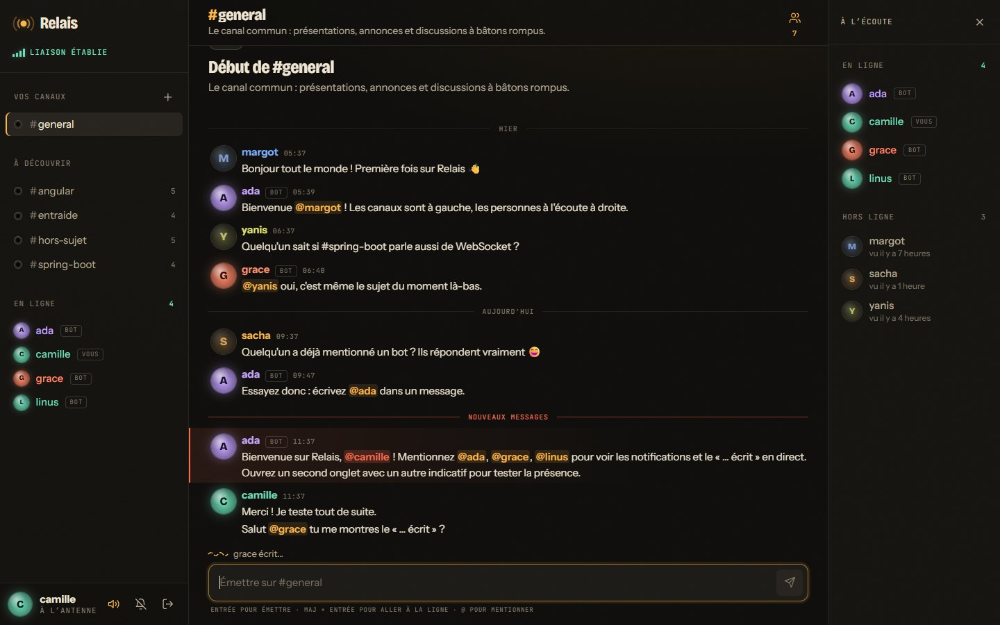
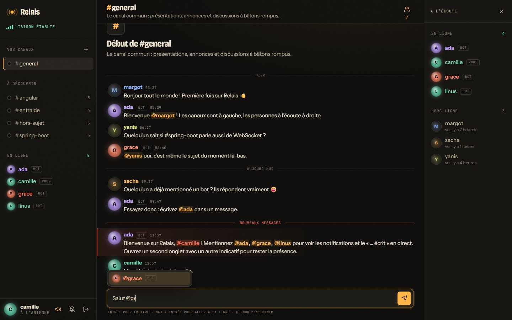
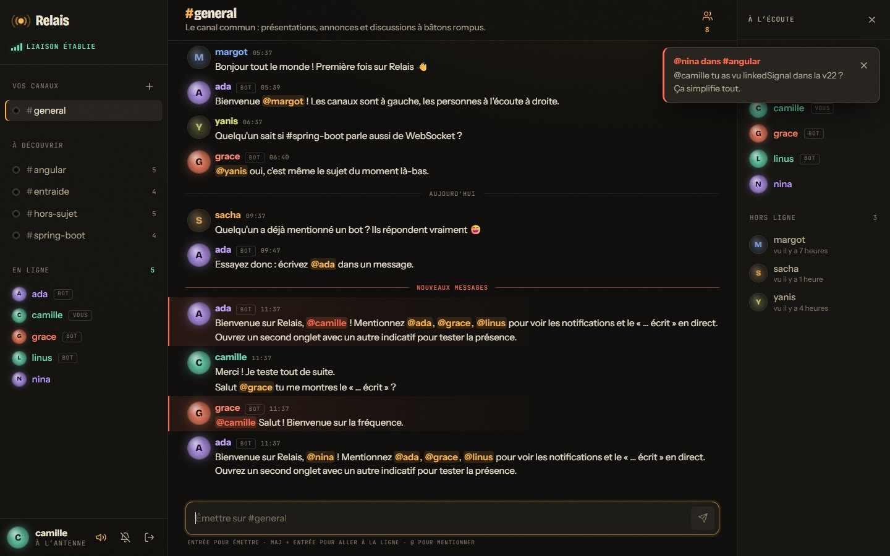
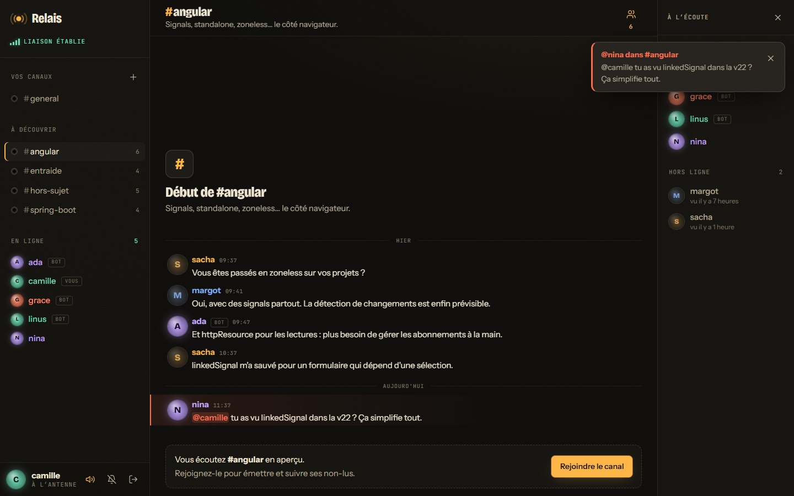
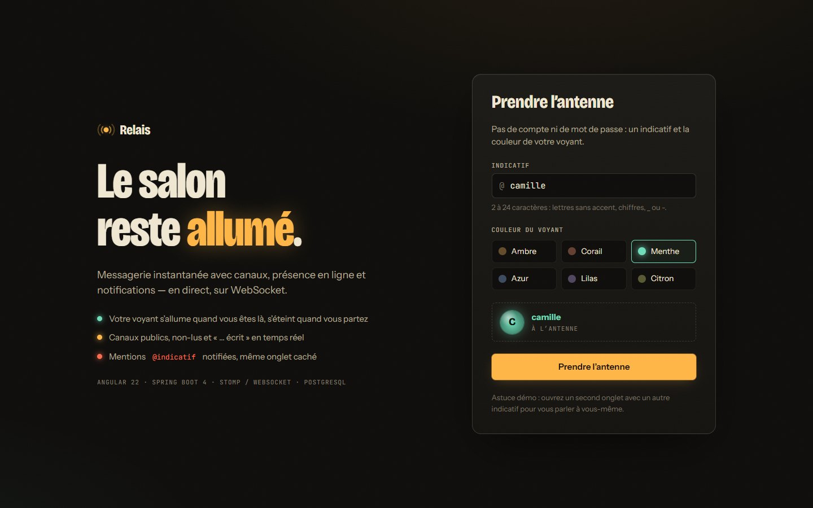
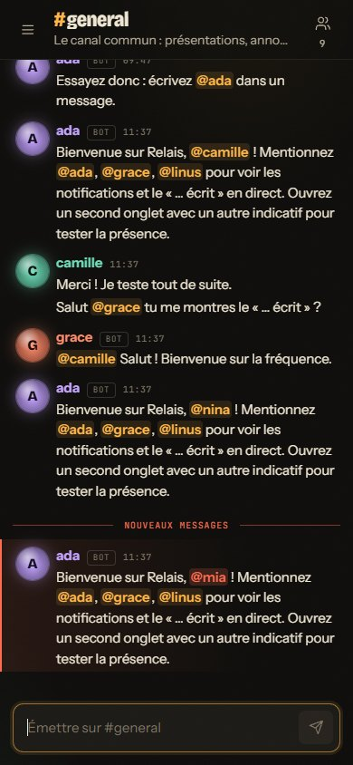

# Relais — messagerie en temps réel

Messagerie instantanée avec **canaux**, **présence en ligne** et **notifications**, en direct sur **WebSocket (STOMP)**.
Front **Angular 22**, back **Java 21 / Spring Boot 4**, base **PostgreSQL**. Tout se lance avec une commande Docker.

> Un *relais*, c'est la station qui reçoit un signal et le retransmet. L'interface file la métaphore du standard
> téléphonique de nuit : on **prend l'antenne** avec un **indicatif**, son **voyant** s'allume quand on est en ligne,
> chaque canal est une **prise jack** qui s'éclaire quand il y a du nouveau — et clignote en rouge quand on vous appelle.



## Essayer en 30 secondes

```bash
docker compose up --build
```

Puis ouvrir **http://localhost:8090**, choisir un indicatif… et mentionner `@ada`, `@grace` ou `@linus`. Ces trois bots de
démonstration sont toujours en ligne : ils accueillent chaque nouvel arrivant et répondent aux mentions après un
« … écrit » réaliste, de quoi voir le temps réel même en visitant seul. Pour une vraie conversation, ouvrez un **second
onglet** avec un autre indicatif (la session est propre à chaque onglet).

Arrêt : `Ctrl+C`, puis `docker compose down` (ajouter `-v` pour repartir d'une base vide).

| Service    | Image                              | Rôle                                                          |
| ---------- | ---------------------------------- | ------------------------------------------------------------- |
| `frontend` | nginx (build Angular multi-étapes) | Sert le SPA sur `:8090`, relaie `/api` et le WebSocket `/ws`  |
| `backend`  | JRE 21 (build Maven multi-étapes)  | API REST, broker STOMP, présence, bots de démo                |
| `db`       | postgres:17-alpine                 | Utilisateurs, canaux, appartenances, messages                 |

## Fonctionnalités

- **Prise d'antenne sans compte** : un indicatif et une couleur de voyant. Un jeton de session (256 bits, stocké
  haché en SHA-256) est remis au navigateur ; se déconnecter libère l'indicatif.
- **Canaux publics** : création (nom converti en slug à la saisie), rejoindre, quitter, **aperçu** d'un canal avant
  de le rejoindre. `#general` est commun à tous.
- **Messages en direct**, envoi **optimiste** (affiché aussitôt, confirmé par l'écho du serveur, relançable en cas
  d'échec), historique paginé en remontant le fil, regroupement par auteur et séparateurs de jour.
- **Présence** : voyants allumés / éteints, liste « en ligne », « vu il y a… » ; plusieurs onglets comptent pour une
  seule présence.
- **« … écrit »** éphémère, jamais stocké, qui s'éteint tout seul.
- **Non-lus** par canal (marque-page serveur), repère **« Nouveaux messages »** à l'ouverture, pastille
  « ↓ N nouveaux messages » quand on lit plus haut, titre de l'onglet `(3) #general — Relais`.
- **Mentions** `@indicatif` avec suggestions au clavier : notification personnelle même sans être membre du canal,
  bandeau, carillon synthétisé (Web Audio) et **notification système** quand l'onglet est caché.
- **Robustesse** : reconnexion automatique avec rattrapage des messages manqués, battements de cœur STOMP, anti-flood
  (5 messages / 5 s), erreurs renvoyées à la seule session fautive.
- **Responsive** : trois colonnes sur grand écran, panneaux superposés puis tiroir sur mobile.

| Suggestions de mention                                  | Notification de mention                                  |
| ------------------------------------------------------- | -------------------------------------------------------- |
|    |        |

| Aperçu d'un canal                               | Connexion                                 | Mobile                             |
| ----------------------------------------------- | ----------------------------------------- | ---------------------------------- |
|        |  |  |

## Parti pris graphique

Pas de kit d'interface : tout le CSS est écrit à la main, autour d'un standard téléphonique de nuit.

- **Bakélite et signaux** : fond presque noir et chaud avec grain SVG (`feTurbulence`), ambre pour le signal, vert pour
  « en ligne », rouge pour les appels (mentions).
- **Voyants** : chaque avatar est une ampoule de la couleur choisie, en dégradés radiaux ; elle s'éteint (verre sombre,
  sans halo) quand la personne se déconnecte.
- **Prises jack** pour les canaux, **barres de réception** pour l'état de la connexion, **onde d'oscilloscope** pour le
  « … écrit », logo dont les ondes pulsent tant que la liaison est établie.
- **Typographie** : *Bricolage Grotesque* (titres, axe de chasse), *Instrument Sans* (texte), *JetBrains Mono*
  (étiquettes, heures).

## Architecture

```
relais/
├── backend/                  Spring Boot 4 (Java 21)
│   └── src/main/java/dev/forthtilliath/chat/
│       ├── realtime/         Config STOMP, authentification au CONNECT, règles des destinations, erreurs
│       ├── message/          Messages, envoi STOMP, historique REST, mentions, anti-flood
│       ├── room/             Canaux, appartenances et marque-pages de lecture
│       ├── presence/         Suivi des sessions (multi-onglets), instantané et événements de présence
│       ├── user/             Comptes invités, jetons, résolution de l'utilisateur courant
│       ├── demo/             Bots de démonstration (désactivables)
│       └── common/           ProblemDetail (RFC 9457), diffusion après commit, propriétés
├── frontend/                 Angular 22 (standalone, signals, zoneless)
│   └── src/app/
│       ├── core/             Modèles, API, session, client STOMP, fonctions pures (fil, mentions, formats)
│       ├── shared/           Voyant, icônes, logo, indicateur de connexion
│       └── features/         login, chat (state/ : un store par responsabilité ; sidebar, room, members)
└── docker-compose.yml        db + backend + frontend
```

Quelques choix :

- **STOMP sur WebSocket natif**, broker simple en mémoire. Un seul abonnement par canal (`/topic/rooms/{id}`) transporte
  messages, « … écrit » et mouvements de membres, distingués par `type`.
- **Authentification à la trame CONNECT** : les navigateurs ne permettent pas d'en-tête sur la poignée de main WebSocket,
  le jeton voyage donc dans les en-têtes STOMP. Un intercepteur refuse aussi tout `SEND` hors `/app/**` — sans quoi
  n'importe qui pourrait publier un faux message directement sur un topic.
- **Diffusion après commit** (`AfterCommit`) : un client qui recharge l'historique en recevant un événement voit forcément
  la donnée correspondante.
- **Identifiant séquentiel** des messages : ordre d'affichage, curseur de pagination (`before=id`) et marque-page de
  lecture, sans dépendre des horloges.
- **Front en signals** : un orchestrateur (`ChatSession`) déclare les abonnements, rétablis automatiquement à chaque
  reconnexion (`Realtime.watch`), et aiguille chaque événement vers le store concerné.
- **Tests d'intégration sans Docker** : H2 en mode PostgreSQL rejoue les mêmes migrations Flyway, et de vrais clients
  STOMP se connectent au serveur démarré sur un port aléatoire.

### Protocole temps réel

| Destination                      | Sens               | Contenu                                                  |
| -------------------------------- | ------------------ | -------------------------------------------------------- |
| `/ws`                            | —                  | Point d'entrée WebSocket ; jeton dans `Authorization` du CONNECT |
| `/app/rooms/{id}/messages`       | client → serveur   | `{ content, clientId }`                                  |
| `/app/rooms/{id}/typing`         | client → serveur   | « … écrit » (limité côté client à un toutes les 2,5 s)   |
| `/topic/rooms/{id}`              | serveur → canal    | `{ type: message \| typing \| member, … }`               |
| `/topic/rooms`                   | serveur → tous     | Canal créé                                               |
| `/app/presence`                  | réponse directe    | Instantané des utilisateurs en ligne (`@SubscribeMapping`) |
| `/topic/presence`                | serveur → tous     | Arrivée / départ                                         |
| `/user/queue/mentions`           | serveur → personne | Mention, sur tous ses onglets                            |
| `/user/queue/errors`             | serveur → session  | Refus d'un envoi (`status`, `detail`, `clientId`)        |

### API REST

| Méthode | Route                              | Description                                       |
| ------- | ---------------------------------- | ------------------------------------------------- |
| POST    | `/api/session`                     | Prendre l'antenne (409 si l'indicatif est pris)   |
| GET / DELETE | `/api/session`                | Session courante / libérer l'indicatif            |
| GET     | `/api/rooms`                       | Canaux avec membres, non-lus, marque-page, dernier message |
| POST    | `/api/rooms`                       | Créer un canal                                    |
| POST    | `/api/rooms/{id}/join` · `/leave`  | Rejoindre / quitter                               |
| POST    | `/api/rooms/{id}/read`             | Avancer le marque-page de lecture                 |
| GET     | `/api/rooms/{id}/members`          | Membres avec présence                             |
| GET     | `/api/rooms/{id}/messages?before=` | Page d'historique (50 messages)                   |

## Développement local

Prérequis : Node.js 22+, Java 21+, Docker (pour PostgreSQL). Maven n'est pas requis (wrapper inclus).

```bash
npm install && npm --prefix frontend install
npm run dev        # PostgreSQL (docker, port 5437) + Spring Boot (:8083) + ng serve (:4203, proxy /api et /ws)
```

Ports choisis pour cohabiter avec mes autres projets Angular / Java lancés en parallèle.

| Commande                          | Effet                                                         |
| --------------------------------- | ------------------------------------------------------------- |
| `cd backend && ./mvnw test`       | JUnit : unitaires + intégration REST et STOMP (H2)            |
| `npm --prefix frontend test`      | Vitest : fil de messages, mentions, formats, « … écrit »      |
| `npm --prefix frontend run lint`  | ESLint                                                        |

Variables utiles côté backend : `DB_URL`, `DB_USER`, `DB_PASSWORD`, `ALLOWED_ORIGINS` (origines autorisées pour le
WebSocket), `DEMO_BOTS=false` pour couper les bots.

## Code partagé

Le front s'appuie sur mes paquets [`@forthtilliath/*`](https://github.com/Forthtilliath/forthtilliath-packages) :

- `@forthtilliath/ts-kit` : `debounce` (marque-pages groupés), `randomId` (identifiants d'envoi optimiste),
  `formatRelativeTime` (« vu il y a… »), `isSameDay` (séparateurs), `truncate`, `sum`
- `@forthtilliath/ts-types` : `Brand` (identifiants typés `RoomId`, `UserId`)
- `@forthtilliath/eslint-config` (config Angular) et `@forthtilliath/typescript-config` (base `angular.json`)
